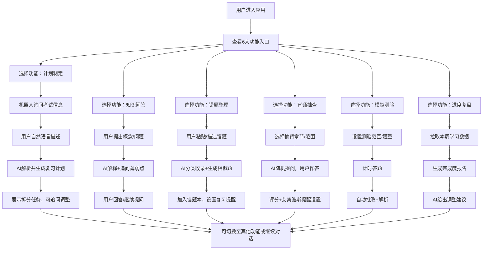

## 1. 产品概述

面向考研和职业资格考生的智能问答式复习陪伴机器人，通过自然语言对话推进复习流程，无需填写复杂表单。产品涵盖从备考计划制定、知识问答到进度复盘的全链路学习场景，帮助考生高效、系统地完成备考。

- 核心价值：6大对话流程覆盖备考全周期，AI驱动的个性化学习路径
- 目标用户：研究生考试、职业资格考试（如CPA、法考、建造师等）考生

## 2. 核心功能

### 2.1 用户角色
| 角色 | 注册方式 | 核心权限 |
|------|----------|----------|
| 考生用户 | 直接使用（本地存储） | 使用全部6大对话流程功能，管理个人学习数据 |

### 2.2 功能模块
1. **聊天主界面**：对话消息流、快捷功能入口、侧边功能栏
2. **计划制定模块**：考试信息采集、任务拆分、每日任务生成
3. **知识问答模块**：概念解释、薄弱点追问、相关知识点联想
4. **错题整理模块**：错题收集、相似题生成、错题本管理
5. **背诵抽查模块**：章节选择、抽背提问、艾宾浩斯复习提醒
6. **模拟测验模块**：计时小测、选择题批改、答案解析
7. **进度复盘模块**：本周完成度统计、计划调整建议

### 2.3 页面详情
| 页面名称 | 模块名称 | 功能描述 |
|----------|----------|----------|
| 主页面 | 顶部导航栏 | 品牌标识、当前考试信息、设置按钮 |
| 主页面 | 快捷功能区 | 6大功能卡片入口，点击直接进入对应对话流程 |
| 主页面 | 聊天对话区 | 消息气泡展示、输入框、快捷回复建议、Typing动画 |
| 主页面 | 侧边功能栏 | 考试设置、错题本、进度统计、复习提醒列表 |
| 主页面 | 对话流引导 | 根据当前流程状态智能推荐下一步操作 |
| 计划制定弹窗 | 考试信息表单 | 自然语言引导式采集考试科目、日期、每日可用时长 |
| 计划制定弹窗 | 任务拆分展示 | 甘特图/列表形式展示拆分后的每日学习任务 |
| 错题本弹窗 | 错题列表 | 按科目/章节/时间分类展示收集的错题 |
| 错题本弹窗 | 相似题推荐 | 针对选中错题生成的相似练习题目 |
| 进度统计弹窗 | 数据可视化 | 本周学习时长、任务完成率、错题回顾率图表 |
| 背诵抽查弹窗 | 章节选择器 | 知识点树结构，支持选择抽背范围 |
| 模拟测验弹窗 | 计时面板 | 倒计时、题目导航、答题卡状态 |
| 模拟测验弹窗 | 结果解析 | 得分统计、错题定位、详细解析展示 |

## 3. 核心流程

用户打开应用 → 选择或触发6大功能之一 → 机器人以自然语言引导对话 → 用户用日常语言回复推进流程 → 系统自动解析意图并执行对应操作 → 输出结构化结果或继续追问 → 流程结束后可切换至其他功能或继续深入

## 4. 用户界面设计

### 4.1 设计风格
- **主色调**：深海蓝 #1E3A8A（专业、沉稳），搭配琥珀金 #F59E0B（激励、重点）
- **辅助色**：薄荷绿 #10B981（正确/完成）、珊瑚红 #EF4444（错误/警示）、天空蓝 #3B82F6（链接/交互）
- **按钮风格**：圆润胶囊型，渐变填充，悬停微放大+阴影加深
- **字体**：标题使用「思源宋体」传递知识厚重感，正文使用「Noto Sans SC」保证阅读舒适度
- **布局风格**：左侧导航+中间对话区+右侧功能面板的三栏式布局，卡片式模块化设计
- **图标风格**：线性+填充混合图标，使用 Phosphor Icons 风格，功能入口配大尺寸彩色图标

### 4.2 页面设计概述
| 页面名称 | 模块名称 | UI元素 |
|----------|----------|--------|
| 主页面 | 顶部导航栏 | 渐变背景、品牌Logo配衬线字体、考试信息徽章、毛玻璃效果 |
| 主页面 | 快捷功能区 | 6张渐变卡片网格布局，悬浮3D效果，图标+标题+一句话描述 |
| 主页面 | 聊天对话区 | 用户消息右对齐蓝底白字、机器人消息左对齐白底深色字、代码块高亮、快捷回复芯片、输入框带发送按钮+语音图标 |
| 主页面 | 侧边功能栏 | 可折叠面板、进度环、错题计数徽章、复习提醒列表带倒计时 |
| 功能弹窗 | 通用弹窗 | 顶部渐变标题栏、圆角大尺寸卡片、底部操作按钮组、进入缩放动画 |
| 数据可视化 | 图表区 | 渐变柱状图、环形进度图、平滑折线图，配色与主题统一 |

### 4.3 响应式设计
- 桌面端（≥1280px）：三栏完整布局，所有功能区同时展示
- 平板端（768-1279px）：侧边功能栏默认折叠，对话区自适应宽度
- 移动端（<768px）：单栏布局，功能入口改为底部Tab导航，弹窗全屏展示

### 4.4 动效与微交互
- 页面加载：功能卡片 staggered fade-in（100ms间隔）
- 消息发送：气泡滑入+弹性动画
- AI思考中：三点跳动Typing动画
- 按钮交互：悬停 translateY(-2px) + 阴影扩散
- 弹窗打开：scale(0.9)→scale(1) + 背景模糊过渡
- 完成操作：成功图标弹跳+轻微粒子效果
