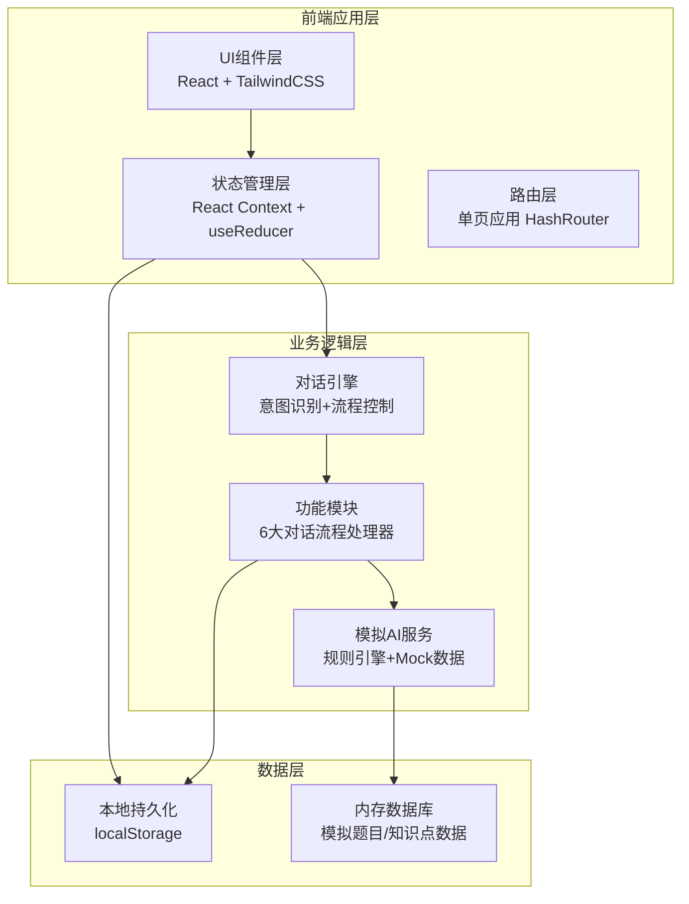
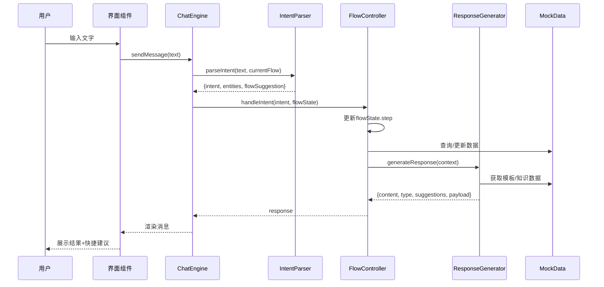
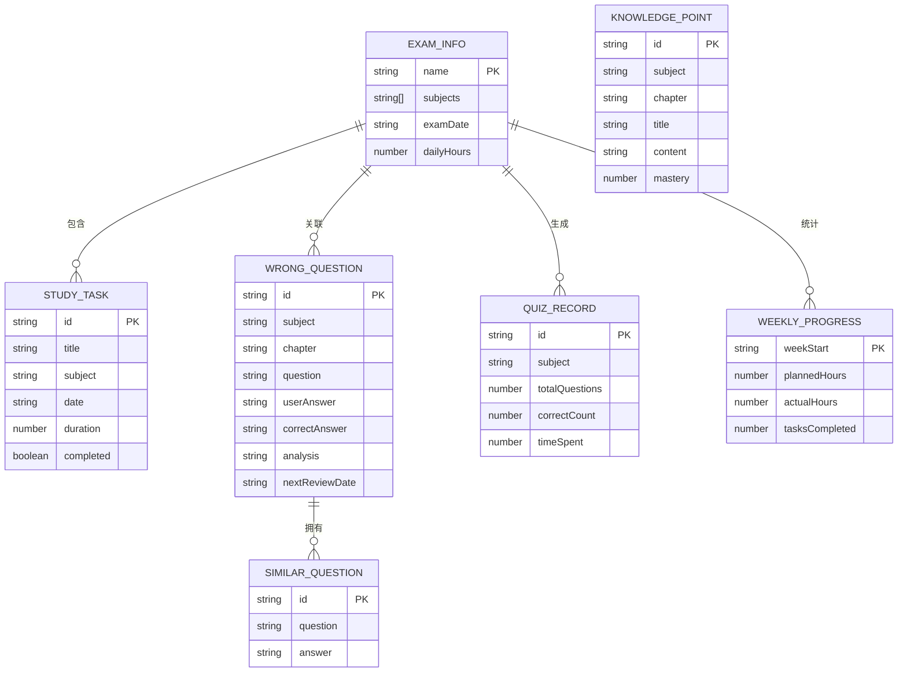

## 1. 架构设计



## 2. 技术选型说明

- **前端框架**：React@18 + TypeScript@5 —— 组件化开发，类型安全，生态成熟
- **构建工具**：Vite@5 —— 极速冷启动和HMR，开发体验优秀
- **样式方案**：TailwindCSS@3 —— 原子化CSS，快速构建一致UI，响应式便捷
- **图标库**：@phosphor-icons/react —— 风格统一、种类丰富的线性+填充图标
- **图表库**：recharts@2 —— React友好的图表组件，支持渐变、动画
- **状态管理**：React Context + useReducer —— 轻量方案，避免过度工程化
- **数据持久化**：localStorage —— 无需后端，用户数据本地存储
- **路由**：react-router-dom@6 —— 单页应用路由管理（可选，视复杂度决定）

## 3. 目录结构定义

```
src/
├── components/              # 通用UI组件
│   ├── layout/             # 布局组件（Header, Sidebar, Container）
│   ├── chat/               # 聊天相关组件（MessageBubble, InputBar, TypingIndicator）
│   ├── cards/              # 卡片组件（FeatureCard, TaskCard, WrongQuestionCard）
│   ├── modal/              # 弹窗组件（通用Modal容器+各功能弹窗）
│   └── charts/             # 图表组件（ProgressChart, BarChart, RingChart）
├── modules/                # 6大功能模块
│   ├── plan/               # 计划制定模块
│   ├── qa/                 # 知识问答模块
│   ├── wrongbook/          # 错题整理模块
│   ├── recite/             # 背诵抽查模块
│   ├── quiz/               # 模拟测验模块
│   └── review/             # 进度复盘模块
├── engine/                 # 对话引擎核心
│   ├── ChatEngine.ts       # 对话引擎主类
│   ├── IntentParser.ts     # 自然语言意图解析器
│   ├── FlowController.ts   # 对话流程控制器
│   └── ResponseGenerator.ts# 响应生成器
├── store/                  # 状态管理
│   ├── AppContext.tsx      # 全局Context
│   ├── types.ts            # 类型定义
│   └── reducer.ts          # Reducer逻辑
├── data/                   # Mock数据
│   ├── questions.ts        # 题库Mock数据
│   ├── knowledge.ts        # 知识点Mock数据
│   └── templates.ts        # 对话模板
├── hooks/                  # 自定义Hooks
│   ├── useLocalStorage.ts  # 本地存储Hook
│   └── useTimer.ts         # 计时器Hook
├── utils/                  # 工具函数
│   ├── dateUtils.ts        # 日期处理
│   └── stringUtils.ts      # 字符串处理
├── styles/                 # 全局样式
│   └── globals.css         # Tailwind入口+自定义样式
├── App.tsx                 # 应用入口组件
└── main.tsx                # React挂载入口
```

## 4. 核心类型定义

```typescript
// 消息类型
interface Message {
  id: string;
  role: 'user' | 'assistant';
  content: string;
  type: 'text' | 'card' | 'quiz' | 'task_list' | 'chart';
  timestamp: number;
  suggestions?: string[];
  payload?: any;
}

// 考试信息
interface ExamInfo {
  name: string;           // 考试名称，如"2025年考研"
  subjects: string[];     // 科目列表
  examDate: string;       // 考试日期
  dailyHours: number;     // 每日可用时长（小时）
}

// 学习任务
interface StudyTask {
  id: string;
  title: string;
  subject: string;
  date: string;
  duration: number;       // 预计分钟数
  completed: boolean;
  priority: 'high' | 'medium' | 'low';
}

// 错题
interface WrongQuestion {
  id: string;
  subject: string;
  chapter: string;
  question: string;
  options?: string[];
  userAnswer: string;
  correctAnswer: string;
  analysis: string;
  addedAt: number;
  reviewCount: number;
  nextReviewDate: string;
  similarQuestions?: SimilarQuestion[];
}

// 相似题
interface SimilarQuestion {
  id: string;
  question: string;
  options?: string[];
  answer: string;
}

// 背诵知识点
interface KnowledgePoint {
  id: string;
  subject: string;
  chapter: string;
  title: string;
  content: string;
  mastery: number;        // 0-100掌握度
  lastReviewAt?: number;
}

// 测验记录
interface QuizRecord {
  id: string;
  subject: string;
  chapter?: string;
  totalQuestions: number;
  correctCount: number;
  timeSpent: number;      // 秒
  completedAt: number;
  questions: QuizQuestion[];
}

// 测验题目
interface QuizQuestion {
  id: string;
  question: string;
  options: string[];
  correctIndex: number;
  userAnswer?: number;
  analysis: string;
}

// 周度进度
interface WeeklyProgress {
  weekStart: string;
  plannedHours: number;
  actualHours: number;
  tasksCompleted: number;
  tasksTotal: number;
  wrongReviewed: number;
  wrongTotal: number;
}

// 对话流程状态
type FlowType = 'plan' | 'qa' | 'wrongbook' | 'recite' | 'quiz' | 'review' | 'idle';
interface FlowState {
  currentFlow: FlowType;
  step: number;
  context: Record<string, any>;
}
```

## 5. 对话引擎设计



## 6. 数据模型（本地存储结构）



## 7. 6大功能模块API（模块方法）

| 模块 | 方法 | 说明 |
|------|------|------|
| PlanModule | collectExamInfo(text) | 解析用户输入，提取考试名称/科目/日期/时长 |
| PlanModule | generatePlan(examInfo) | 基于考试信息生成拆分后的每日任务列表 |
| PlanModule | adjustPlan(tasks, feedback) | 根据用户反馈调整计划 |
| QAModule | explainConcept(concept) | 返回概念解释、相关知识点、追问建议 |
| QAModule | digDeeper(concept, answer) | 根据用户回答判断薄弱点，继续深入提问 |
| WrongBookModule | addWrongQuestion(q) | 收录错题，自动分类，生成相似题 |
| WrongBookModule | getReviewList(date) | 获取今日应复习的错题列表（艾宾浩斯） |
| WrongBookModule | generateSimilar(q) | 生成3-5道相似练习题 |
| ReciteModule | getChapterTree(subject) | 返回科目章节知识点树 |
| ReciteModule | randomQuiz(chapters) | 从选中章节随机抽取背诵题 |
| ReciteModule | gradeAnswer(kpId, answer) | 评估背诵回答，更新掌握度，安排下次复习 |
| QuizModule | generateQuiz(filter, count) | 按条件生成指定数量选择题 |
| QuizModule | gradeQuiz(answers) | 批改答案，返回得分+每题解析 |
| ReviewModule | getWeeklyStats() | 计算本周各项指标完成度 |
| ReviewModule | suggestAdjustments(stats) | 基于数据给出下一阶段调整建议 |
